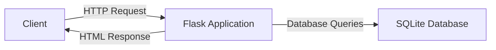
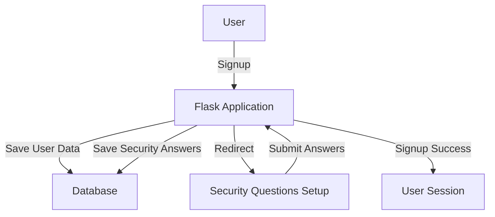
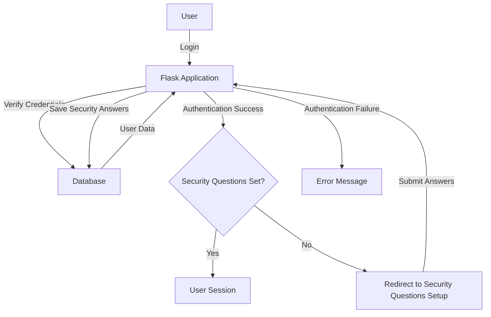
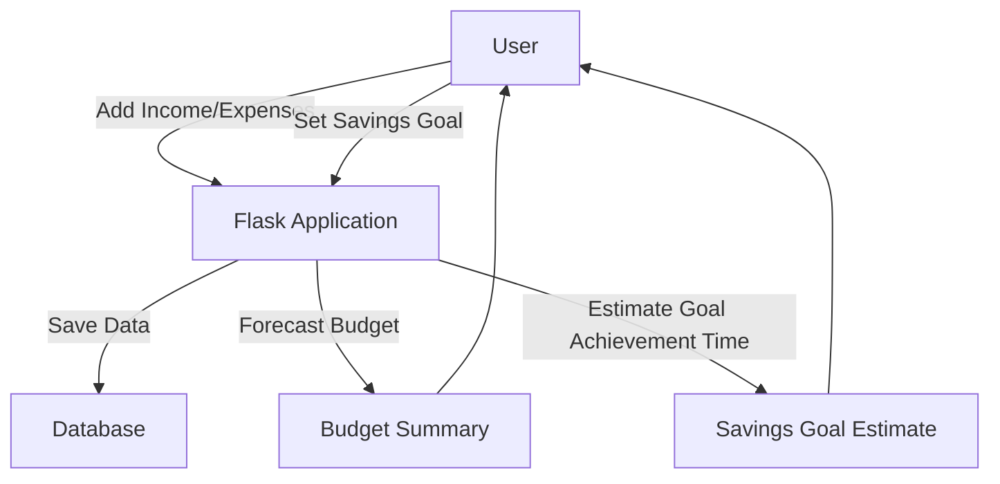
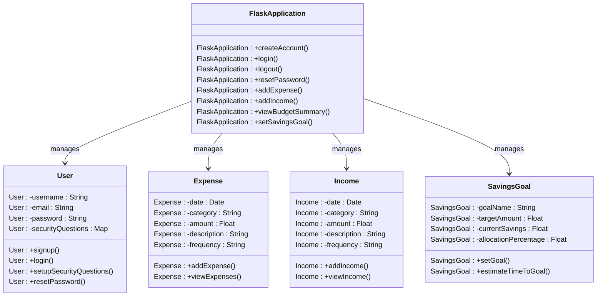

# CSCI-5300
Budget Web Application

# Installation and Run
## first change directory to expense manager folder 
`cd Expense manager`

## activate virtual environment
for mac : `source myenv/bin/activate`
for windows : `myenv\Scripts\activate`

## install requirments
`pip install -r requirements.txt`

# High-Level Design Document

## Overview
This Flask application is a personal finance management system that allows users to track their expenses and income, forecast their monthly budgets, set savings goals, and estimate the time required to achieve those goals. The application provides user authentication, expense and income tracking, and reporting features.

## Project Description
The system shall allow users to:
- Forecast their monthly budgets using user-data about income and expenses.
- Specify the frequency of expenses and income (weekly, bi-weekly, monthly, etc.).
- Retain user data from session to session.
- Provide security for stored user budget data.
- Set savings goals for specific items (i.e., house down payment).
- Forecast the time it will take users to achieve their savings goal if they were to allocate a given percentage of their disposable income to the goal every pay period.

## User Stories (Sprint 1)
1. As a user, I want to be able to create an account so that I can access the budgeting system.
2. As a user, I want to be able to log in to my account securely so that I can view and manage my financial data.
3. As a user, I want to be able to add my income and expenses with their respective frequencies so that I can track my financial activities.
4. As a user, I want to be able to view my current budget summary so that I can understand my financial situation.
5. As a user, I want to be able to set a savings goal for a specific item and estimate the time required to achieve that goal based on my disposable income allocation.

## Architecture
The application follows a client-server architecture, with the client being a web browser and the server being a Flask application running on a web server. The application uses SQLite as the database to store user information, expenses, income data, and savings goals.

## Main Components
1. **Flask Application**: The core of the application is built using the Flask web framework. It handles routing, request processing, and response generation.

2. **User Authentication**: The application uses Flask-Login for user authentication. It provides features like user signup, login, logout, and password reset. The user passwords are hashed using Werkzeug's security module before storing them in the database.

3. **Database**: SQLite is used as the database to store user information, expenses, income data, and savings goals. The application uses Flask's `g` object to manage database connections.

4. **Templates**: The application uses HTML templates to render the user interface. The templates are stored in the `templates` directory and are rendered using Jinja2 templating engine.

5. **Static Files**: The static files (CSS stylesheets) are stored in the `static` directory and are served by the Flask application.

6. **Budget Forecasting**: The application includes functionality to forecast monthly budgets based on user-provided income and expense data. It takes into account the frequency of each transaction to generate accurate budget forecasts.

7. **Savings Goal Tracking**: Users can set savings goals for specific items and allocate a percentage of their disposable income towards those goals. The application estimates the time required to achieve each goal based on the user's disposable income and allocation percentage.

## User Interface
The user interface consists of the following main pages:
- Homepage
- User Signup
- User Login
- Security Questions Setup
- Password Reset
- Add Expense
- Add Income
- View Expenses
- View Income
- Budget Summary
- Savings Goal Setup

The pages are designed using HTML and styled using CSS.

## Data Model
The application uses the following database tables:
1. **users**: Stores user information, including username, email, password (hashed), and security questions and answers.
2. **expenses**: Stores expense data, including date, category, amount, description, and frequency. Each expense is associated with a user.
3. **incomes**: Stores income data, including date, category, amount, description, and frequency. Each income is associated with a user.
4. **savings_goals**: Stores savings goal data, including goal name, target amount, current savings, allocation percentage, and associated user.

## Security
The application implements several security measures:
- User passwords are hashed using Werkzeug's security module before storing them in the database.
- Flask-Login is used to manage user sessions and restrict access to certain routes based on authentication status.
- User inputs are validated and sanitized to prevent SQL injection and other security vulnerabilities.
- Password complexity requirements are enforced during user signup and password reset.
- Account lockout mechanism is implemented to prevent brute-force attacks.

## Diagrams

### Architecture Diagram

### Signup Flow

### Login Flow

### Budget Forecasting and Savings Goal Flow

# UML

## Conclusion
This updated high-level design document incorporates the project description and the first 5 user stories for sprint 1. It provides an overview of the Flask application for personal finance management, including budget forecasting and savings goal tracking features. The document describes the main components, user interface, data model, security measures, and includes diagrams to illustrate the architecture and key flows of the application.

